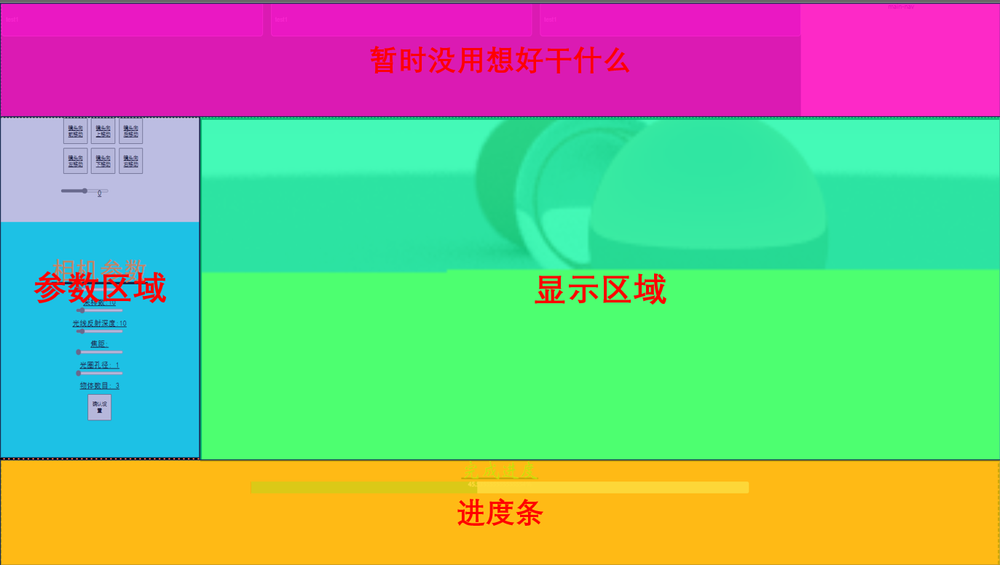
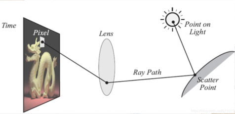

# Javascript期末项目——网页光线追踪PathTracing算法
孙海岳 2100013127

摘要：本项目通过Typescript语言实现了在浏览器上即时计算的光线追踪算法。项目可以大致分为两部分，第一部分为网页设计，包含HTML以及CSS的编写；第二部分为Javascript逻辑，在这里主要实现了光追的计算以及接受网页可视化调整的参数和将计算结果输出到网页上。
关键词：光线追踪  Javascript  Web编程

# 一、	HTML与Web编程
## （一）	HTML文件与Web页面布局
### 1.	页面布局
 

### 2.	HTML文件
文件实现中，我用button元素实现窗口中的按钮，用Canvas实现窗口界面，用Input range实现可拖动输入，用progress实现进度条的功能。并利用多个div进行窗口分区，从而实现上述布局。
## （二）	CSS样式
CSS样式主要在于对HTML中部分元素的样式进行布局和简单的调整，通过使用class、id选择器对一类的元素样式进行修改，从而得到最终的效果和页面的布局。
# 二、	Typescript编程
## （一）	光线追踪算法介绍

光线追踪的概念在于通过模拟相机模型接受光线的原理，从而实现对图像的渲染。具体流程为建立相机系统和世界模型，从相机系统对每个图像的像素位置采样光线，利用光线与世界模型中的物体进行交互并返回色彩值。对返回的多个色彩值取平均确定像素的颜色。
	至于光线与世界模型的交互，主要分为环境光、反射光、折射光。其中后两部分取决于物体的材质，这些材质会影响物体展示的颜色、物体的反射率、折射率等。
## （二）	Typescript模块介绍
为了实现光线追踪的效果，代码分为以下10个文件，分别为：camera、color、hittable_list、hittable、index、material、others、ray、sphere、vec3。其中具体功能根据其命名有所不同。整个代码的数学库为vec3，包含了三元向量类的声明以及与向量相关的运算。Sphere声明了时间模型中物体的类，ray包含了光线类，others定义了一些和随机数、常量有关的信息，material包含了材料抽象类和3种具体的材料（金属、朗博材料、非传导材料），hittable声明了在光线与物体交互过程中碰撞位置的信息的类，hittable_list声明了用作世界模型的物体集合列表类，color包含了最终写回canvas颜色的函数，camera声明了相机类以实现相机系统，index作为主函数，包含了光线的采样，第一次碰撞，像素颜色的获取，世界模型的随机初始化，进度条运行等。
## （三）	技术细节、遇到的问题
### 1、	缺乏重载运算符的类
在实现类的过程中，最基础的数学模块向量显然需要配套的计算，这里我本想使用重载运算符的方式实现与C++中相同的形式，从而简化后续的代码编程，然而天有不测风云，经过我的查找，Typescript并不支持重载运算符的行为，因此诸如加减乘除等向量操作，需要使用函数的形式进行计算，因此在代码中充满了诸如add、mul等函数，十分不简洁，尤其是当公式较为复杂的时候。
### 2、	传值与传引用
Typescript与C++的底层逻辑不同，因此其无法使用诸如指针、引用等功能，然而在光线追踪的过程中，许多函数需要返回多个值，或是需要对传入的值进行修改。这时Typescript需要采用一种极其奇怪却又非常符合语言本身特性的方式——传对象的实例并修改对象的property。这一点看似非常清晰，然而在实际coding过程中，经常会出现忘了这件事的情况，尤其是直接赋值的时候。因此，对于部分类，需要实现一些类似copy的函数，实现修改类的property的功能。
### 3、	异步编程的问题
Typescript的异步编程主要是利用Promise函数进行。通过设置Promise函数，并在async函数中用await调用，从而实现异步编程。这听上去很美好，然而在光线追踪，异步的使用主要是在循环计算像素颜色的过程中，使得能够在计算颜色的过程中刷新进度条，同时保证浏览器不卡。然而，当一个明媚的下午，我将异步编程实现后，惊奇的发现，Typescript居然没用配套类似于进程锁之类的东西，以至于它将在计算过程中，在我的计算机后台出现大约500个以上的线程，导致整个windows桌面系统直接卡死。为了解决该问题，我尝试了使用Typescript的库p-limits，然而并不能解决问题。最终我放弃了异步的方式，转而采用setTimeout来设置像素颜色计算和进度条更新，从而实现在颜色计算的中途插入进度条更新的函数，实现了最终的效果。
# 三、	适配浏览器
## （一）	浏览器的适配问题
我们知道通过tsc命令将Typescript文件转换问Javascript文件，从而可以用于HTML的link过程中。然而，对于某些浏览器（比如edge），其在直接引用的时候，不支持export和import等操作（据说es6支持，但是我调了tsc还是不行，而且es6会导致Typescript的其它问题）。因此需要合并所有文件。
## （二）	Webpack合并文件
为了解决上述问题，我查到了webpack的工具包，其能够将互相引用的Javascript文件合并为一个bundle文件，从而可以直接在Javascript引用。
